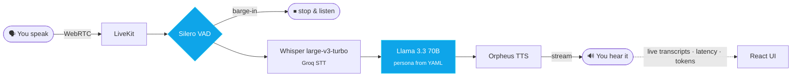
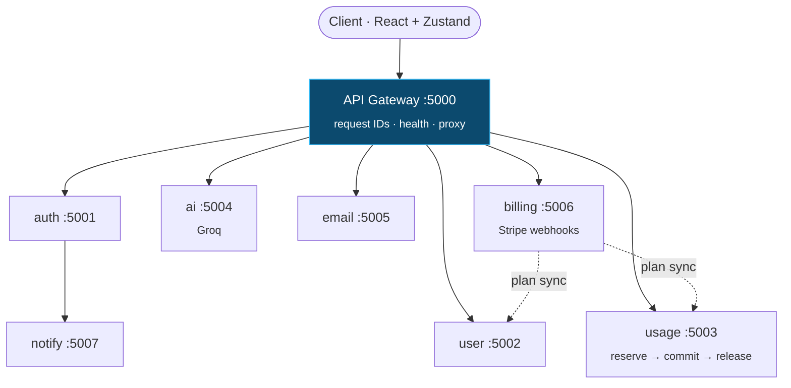

<!-- ═══════════════════════════════════════════════════════════════
     MORYASSHAN · github.com/MORYASSHAN · moryasshan.vercel.app
     ═══════════════════════════════════════════════════════════════ -->

<div align="center">


<a href="https://moryasshan.vercel.app">
  
</a>

<br/>

<a href="https://moryasshan.vercel.app"></a>
<a href="https://acadex.ereefian.com"></a>
<a href="https://cal.com/moryasshan"></a>

<a href="https://www.linkedin.com/in/shaan-goswami-778729274/"></a>
<a href="https://x.com/Shaanjson"></a>
<a href="mailto:shaangoswami1078@gmail.com"></a>


</div>

<br/>

## `~/whoami`

```ts
// moryasshan.config.ts
export const shaan = {
  alias:      "Moryasshan",          // screen name on my GitHub, scripts & stories
  role:       "Full Stack Engineer & Writing Head @ Ereefian (Acadex)",
  education:  "B.Tech CSE · IIIT Bhubaneswar · 2024 → 2028",
  shipping:   "2+ years of production web apps on the MERN stack",
  building:   ["real-time voice AI agents", "microservice SaaS", "3D web in Three.js + GLSL"],
  writing:    ["AI agents", "startups & category stories", "screenplays"],
  awards:     ["Best Script Writer ×2"],
  programs:   ["Growth Fellow @ Frizzel (YC S25)", "McKinsey Forward Learning Program"],
  offCode:    ["🎾 tennis, any time of day", "🧭 solo travel", "🏔️ aspiring mountaineer", "🎬 filmmaking"],
  philosophy: "Every product is a story. Most forget to tell it.",
} as const;
```

<div align="center">

<table>
<tr>
<td align="center" width="25%"><h2>2+</h2><sub>years shipping<br/>production web apps</sub></td>
<td align="center" width="25%"><h2>500+</h2><sub>students surveyed<br/>before building Acadex</sub></td>
<td align="center" width="25%"><h2>−40%</h2><sub>feature release time<br/>via modular RBAC</sub></td>
<td align="center" width="25%"><h2>−35%</h2><sub>avg API response time<br/>via query + schema work</sub></td>
</tr>
</table>

</div>

<br/>

## `~/now`

```diff
+ 🟢 Building Acadex at Ereefian — RBAC, events, notifications, the whole stack
+ 🎙️ Open-sourcing VoiceForge — interruptible voice agents you can run in 5 minutes
+ ✍️  Writing about AI agents & startups (and talking to the founders behind them)
+ 🎓 B.Tech CSE @ IIIT Bhubaneswar · selected for McKinsey Forward Learning
! 🌉 India → San Francisco. Open to internships & interesting problems.
```

<br/>

## `~/projects`

<!-- ── FLAGSHIP ─────────────────────────────────────────────── -->

<table>
<tr>
<td>

### ⭐ Acadex &nbsp;·&nbsp; <sub>flagship · Full Stack Engineer @ Ereefian</sub>

> **One home for everything academic.**

An academic management platform that pulls timetables, attendance, exams, events and notices into one system for **students, teachers and admins**. We surveyed **500+ students and 30+ professors** before writing a line of code, then built Acadex around what they told us.

- 🔐 Designed the **role-based access control** system: one codebase, every role sees exactly what it should
- 🔔 Owned system design for **event management & notification infrastructure**
- 🧩 Modular architecture that cut **feature release cycles by 40%**
- ⚡ Reworked REST queries + MongoDB schemas: **35% faster** average API response
- 📝 Lead writer: every tech blog, technical policy, product doc and README

`Research` → `Design` → `Build` → `Integrate` → `Test` → `Ship`

<a href="https://acadex.ereefian.com"></a>
&nbsp;     

</td>
</tr>
</table>

<!-- ── GRID ─────────────────────────────────────────────────── -->

<table>
<tr>
<td width="50%" valign="top">

### 🎙️ VoiceForge
<sub>OPEN-SOURCE VOICE AI · MIT</sub>

Talk to an AI agent that talks back in real time, **and lets you interrupt it.** A starter kit that takes you from `git clone` to a live voice agent in ~5 minutes, with a setup wizard, bring-your-own-keys and YAML personas (Study Buddy, Meeting Notes, Voice Journal).

`<400ms` end-to-end · `27` passing tests · `4` live visualizers · Docker Compose

     

[**→ repo**](https://github.com/MORYASSHAN/voiceforge)

</td>
<td width="50%" valign="top">

### ✉️ Meakly
<sub>AI SAAS · MICROSERVICES</sub>

An AI outreach workbench that writes **cold emails worth replying to**. Draft, rewrite, generate follow-ups, save favourites and track usage. Built backend-first as **8 independent services behind an API gateway**, with Stripe billing that syncs plans everywhere and a quota system that reserves → commits → releases, so failed generations never cost you.

`8` services · `1` gateway · request IDs traced across every hop · `/metrics` everywhere

     

[**→ repo**](https://github.com/MORYASSHAN/meakly)

</td>
</tr>
<tr>
<td width="50%" valign="top">

### 🛒 JuteIt
<sub>E-COMMERCE PLATFORM · LIVE</sub>

A store for eco-friendly jute products with a **3D storefront in React Three Fiber** and a full owner dashboard for products, orders, banners and inquiries. Monorepo, three JWT roles (buyer / owner / admin), Cloudinary uploads, Nodemailer, plus buyer, owner & admin guides and an API reference.

`3` roles · `7` REST resources · `3D` storefront

    

[**→ live**](https://juteit.vercel.app) · [**repo**](https://github.com/MORYASSHAN/juteit)

</td>
<td width="50%" valign="top">

### 🌃 Coshattan
<sub>3D WEB · PRODUCT STORYTELLING</sub>

A scroll-driven story set in a **3D Manhattan rebuilt from NYC Open Data**. Pick a song, orbit a hologram under 50,000 stars, press *See my dream* and the city rises from the floor, with every sentence written onto a real street, rooftop or Times Square billboard.

> *"People forget features. They remember feelings."*

   

[**→ live**](https://coshattan.vercel.app) · [**repo**](https://github.com/MORYASSHAN/Coshattan)

</td>
</tr>
<tr>
<td width="50%" valign="top">

### 🧬 Aurest Biotech
<sub>CLIENT WEBSITE · DEEP TECH</sub>

Designed and built from scratch for a Jaipur deep-tech startup (incubated at MNIT) making a patent-pending vessel sealant. Opens with *"Medicine needs more time"* over a **3D Earth with custom day, cloud and atmosphere shaders**, then walks you from problem → tech → vision. Honeypot + per-IP rate-limited contact form.

   

[**→ live**](https://aurest.vercel.app) · [**repo**](https://github.com/MORYASSHAN/aurest-)

</td>
<td width="50%" valign="top">

### 🎰 Vegas After Dark
<sub>MY PORTFOLIO · PLAYABLE</sub>

My portfolio isn't a page, it's a game. **Shoot your way through Vegas**, then meet the developer behind it: projects, experience, blogs, stories and life, all inside one interactive 3D experience.

```
← SWIPE TO LOOK AROUND →
     CLICK TO START
```

  

[**→ play it**](https://moryasshan.vercel.app)

</td>
</tr>
</table>

<details>
<summary><b>🔬 Under the hood: VoiceForge's real-time pipeline</b></summary>
<br/>



</details>

<details>
<summary><b>🧱 Under the hood: Meakly's microservice map</b></summary>
<br/>



</details>

<br/>

## `~/stack`

<div align="center">

<sub>LANGUAGES</sub><br/>


<sub>FRONTEND & 3D</sub><br/>


<sub>BACKEND & DATA</sub><br/>


<sub>DEVOPS & TOOLS</sub><br/>


<sub>AI · PAYMENTS · REAL-TIME</sub><br/>


</div>

| Core | |
|:--|:--|
| 🧠 **Systems** | System Design · Microservices · RBAC · REST API & Schema Design · Query Optimization · DSA |
| 🤖 **AI** | AI Agents · Real-time Voice Agents · Prompt Engineering · Structured Output · RAG · MCP |
| 📈 **Growth** | Go-To-Market · Roadmapping & Prioritization · User & Market Research |
| ✍️ **Writing** | Technical Writing · Docs, Policies & READMEs · Startup & Category Stories · Screenplays |

<br/>

## `~/experience`

```yaml
- role:  Full Stack Engineer & Writing Head
  org:   Ereefian · Acadex
  when:  2024 → present · remote
  did:   [ MERN features end to end, RBAC + events + notifications system design,
           -40% release cycles, -35% API latency, led all product & technical writing ]

- role:  Growth Fellow
  org:   Frizzel (YC S25)
  when:  2 months · remote
  did:   [ growth & GTM inside a Y Combinator startup, research, prioritisation at startup speed ]

- role:  Selected Participant
  org:   McKinsey Forward Learning Program
  did:   [ problem solving, communication, leadership ]

- role:  B.Tech, Computer Science & Engineering
  org:   IIIT Bhubaneswar
  when:  2024 → 2028
  did:   [ DSA, System Design, a lot of C++ ]
```

<br/>

## `~/writing`

> *Off the keyboard, I'm a storyteller. I write as **Moryasshan**.* &nbsp; 🏆 **Best Script Writer ×2**

| | Piece | What it is |
|:--:|:--|:--|
| 🤖 | **How my curiosity grew my knowledge of making AI agents** | An AI agent, mapped: structured output, system prompts, tools & MCP, RAG and one request traced end to end. *5 boxes, 7 RAG knobs, 0 magic.* |
| 🧩 | [**Understanding Raw LLMs vs AI Agents**](https://moryasshan.vercel.app/blogs/raw-llms-vs-ai-agents.pdf) | The model is the engine, the product is the whole car. A forward-deployed engineer's view. |
| 🛍️ | [**Shaan × Amboras: Five Stories for Agentic Commerce**](https://shaan-amboras.ploy.build/abm/amboras) | I didn't send a résumé, I wrote the category story: 5 essays, 5 posts, 1 founder letter. |
| 🚀 | [**Writing about Bullet**](https://lnkd.in/p/ei5XyfMa) | A startup growth breakdown, written after using the product and talking to the team. |
| 🎬 | [**Mind**](https://moryasshan.vercel.app/stories/mind.pdf) | Original 15-page screenplay about heartbreak, overthinking and the subconscious. |
| 📖 | [**Slum Line Escaper**](https://moryasshan.vercel.app/stories/slum-line-escaper.pdf) | Short story: a 17-year-old from Dharavi turns mehendi art into fashion. |

<br/>

## `~/stats`

<div align="center">


<br/>


</div>

<br/>

<div align="center">

```
┌──────────────────────────────────────────────────────────────┐
│  Code, words, films or a long walk up a mountain:            │
│  it's all the same thing to me. I'm trying to understand     │
│  people, and tell their story well.            — Moryasshan  │
└──────────────────────────────────────────────────────────────┘
```

<a href="https://moryasshan.vercel.app"></a>
<a href="https://cal.com/moryasshan"></a>


</div>
