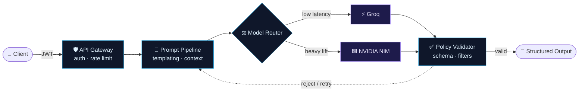

<!-- ═══════════════════════════════  HEADER  ═══════════════════════════════ -->
<div align="center">


<a href="https://moryasshan.vercel.app">
  
</a>

<br/>

<a href="https://moryasshan.vercel.app"></a>
<a href="https://www.linkedin.com/in/shaan-goswami-778729274/"></a>
<a href="mailto:itsmoryasshan@gmail.com"></a>
<a href="https://acadex.ereefian.com"></a>


</div>


<!-- ═══════════════════════════════  WHOAMI  ═══════════════════════════════ -->

## `$ whoami`

<table>
<tr>
<td width="55%" valign="top">

```yaml
shaan@github:~$ neofetch --profile

  user        : Shaan Goswami  (@MORYASSHAN)
  role        : Full Stack Engineer (MERN) + AI Systems
  edu         : B.Tech CSE · IIIT Bhubaneswar · 2024–28
  uptime      : 2+ yrs shipping production web apps
  shell       : node / express / mongo / react
  kernel      : system design · REST · RBAC
  ai_runtime  : NVIDIA NIM · Groq · prompt pipelines
  now         : building Acadex @ Ereefian
  focus       : [backend arch, API design,
                 AI agents, distributed systems]
  status      : ● open to internships
  next_hop    : San Francisco
```

</td>
<td width="45%" valign="top">

### ⚙️ Runtime metrics

| metric | value |
|:--|:--:|
| ⚡ API latency cut | **~35%** |
| 🚢 Release cycle cut | **~40%** |
| 🧱 Products shipped solo | **2** |
| 🔐 RBAC roles in Acadex | **4** |
| ⏱️ Years in production | **2+** |

<sub>↳ via query optimization, schema redesign & modular RBAC</sub>

</td>
</tr>
</table>


<!-- ═══════════════════════════════  PROJECTS  ═══════════════════════════════ -->

## `$ ls ./shipped`

<table>
<tr>
<td width="33%" valign="top" align="center">

### 🏫 Acadex
<sub><code>PRODUCTION · INSTITUTIONAL</code></sub>

<p align="left">Unified academic platform — attendance, scheduling, resources & comms across <b>admin / teacher / CR / student</b> roles. Built the academic assistant and a dynamic form/workflow engine end-to-end.</p>


<br/><br/>

<a href="https://acadex.ereefian.com"></a>

</td>
<td width="33%" valign="top" align="center">

### 🛒 JuteIt
<sub><code>FULL-STACK · E-COMMERCE</code></sub>

<p align="left">End-to-end commerce platform — auth, catalog, order workflows and checkout, deployed to production. Firebase Auth with <b>role-based route protection</b> throughout.</p>


<br/><br/>

<a href="https://github.com/MORYASSHAN/juteit"></a>

</td>
<td width="33%" valign="top" align="center">

### ✉️ ColdMailAI
<sub><code>AI SAAS · LLM ROUTING</code></sub>

<p align="left">Routes inference through <b>NVIDIA NIM + Groq</b>, with backend policy logic that validates and filters structured model output. Auth, prompt pipeline, API gateway, rate limiting.</p>


<br/><br/>

<a href="https://github.com/MORYASSHAN/meakly"></a>

</td>
</tr>
</table>

<details>
<summary><b>🧠 &nbsp;Peek inside ColdMailAI — how the LLM pipeline is wired</b></summary>
<br/>



<sub>Non-deterministic model in → deterministic contract out.</sub>
</details>


<!-- ═══════════════════════════════  STACK  ═══════════════════════════════ -->

## `$ cat stack.json`

<div align="center">

<table>
<tr><td align="right"><b><code>languages</code></b></td><td></td></tr>
<tr><td align="right"><b><code>frontend</code></b></td><td></td></tr>
<tr><td align="right"><b><code>backend</code></b></td><td>  </td></tr>
<tr><td align="right"><b><code>data · cloud</code></b></td><td></td></tr>
<tr><td align="right"><b><code>ai · systems</code></b></td><td>    </td></tr>
<tr><td align="right"><b><code>tooling</code></b></td><td></td></tr>
</table>

</div>


<!-- ═══════════════════════════════  TELEMETRY  ═══════════════════════════════ -->

## `$ git log --stats`

<div align="center">


</div>

<!-- ═══════════════════════════════  SNAKE  ═══════════════════════════════ -->

<div align="center">

<picture>
  <source media="(prefers-color-scheme: dark)" srcset="https://raw.githubusercontent.com/MORYASSHAN/MORYASSHAN/output/github-contribution-grid-snake-dark.svg"/>
  <source media="(prefers-color-scheme: light)" srcset="https://raw.githubusercontent.com/MORYASSHAN/MORYASSHAN/output/github-contribution-grid-snake.svg"/>
  
</picture>

</div>


<!-- ═══════════════════════════════  FOOTER  ═══════════════════════════════ -->

<div align="center">

### `$ ./connect --build-something-together`

<sub>Got an internship, a hard backend problem, or an AI system that needs to behave? Let's talk.</sub>

<br/><br/>

<a href="mailto:itsmoryasshan@gmail.com"></a>
<a href="https://moryasshan.vercel.app"></a>
<a href="https://www.linkedin.com/in/shaan-goswami-778729274/"></a>

<br/><br/>


</div>
